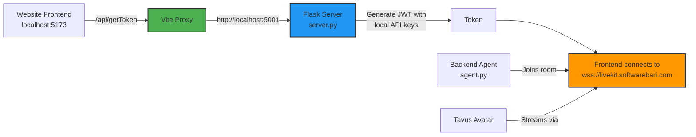

# 🔧 Fix Summary: Invalid API Key Error

## Problem Identified

The "Invalid API Key" error was caused by the **Vite proxy configuration** pointing to a remote server instead of your local backend.

### Root Cause

In [`vite.config.ts`](file:///d:/personal%20projects/AI%20Avatar/AI%20Gym%20Avatar/website/vite.config.ts):

```typescript
// ❌ BEFORE - pointing to remote server
proxy: {
  "/api": {
    target: "http://137.184.129.34:5001",  // Remote server with different API keys
    changeOrigin: true,
    rewrite: (path) => path.replace(/^\/api/, "")
  }
}
```

When the frontend called `/api/getToken`, it was proxied to the remote server at `137.184.129.34:5001`, which has **different LiveKit API credentials**. Those credentials don't match your local LiveKit deployment at `wss://livekit.softwarebari.com`.

## Solution Applied

Updated [`vite.config.ts`](file:///d:/personal%20projects/AI%20Avatar/AI%20Gym%20Avatar/website/vite.config.ts) to use localhost:

```typescript
// ✅ AFTER - pointing to local server
proxy: {
  "/api": {
    target: "http://localhost:5001",  // Your local server with correct API keys
    changeOrigin: true,
    rewrite: (path) => path.replace(/^\/api/, "")
  }
}
```

## Verification

I created and ran a test script ([`test_env.py`](file:///d:/personal%20projects/AI%20Avatar/AI%20Gym%20Avatar/backend/test_env.py)) that confirmed:

✅ All environment variables are loaded correctly:
- `LIVEKIT_URL`: wss://livekit.softwarebari.com
- `LIVEKIT_API_KEY`: APImpTrdwk...
- `LIVEKIT_API_SECRET`: GklskfxXG8...
- `OPENAI_API_KEY`: sk-proj-h6...
- `PERSONA_ID`: p4f2e36bd509
- `REPLICA_ID`: rf4703150052
- `TAVUS_API_KEY`: 66415ba5da...

✅ Token generation works locally

## Next Steps

**You need to restart both servers for the changes to take effect:**

### 1. Restart Backend Server

```bash
# Stop the current server (Ctrl+C if running)
cd "d:\personal projects\AI Avatar\AI Gym Avatar\backend"
python server.py
```

### 2. Restart Website Dev Server

```bash
# Stop the current dev server (Ctrl+C if running)
cd "d:\personal projects\AI Avatar\AI Gym Avatar\website"
npm run dev
```

### 3. Test the Connection

1. Open your browser and navigate to the website
2. Open browser DevTools (F12) → Console tab
3. Try to connect to the avatar
4. You should see the connection succeed without "Invalid API Key" errors

## Important Reminders

### DNS Configuration Still Required

For the LiveKit connection to work, you **must** have DNS records configured:

- `livekit.softwarebari.com` → Your server IP
- `livekit-turn.softwarebari.com` → Your server IP  
- `livekit-whip.softwarebari.com` → Your server IP

Without proper DNS, you'll see WebSocket connection errors instead.

### Backend Agent Must Be Running

Don't forget to also run the agent in a separate terminal:

```bash
cd "d:\personal projects\AI Avatar\AI Gym Avatar\backend"
python agent.py
```

This is what actually handles the Tavus avatar session.

## Architecture Flow



## Files Modified

1. ✅ [`vite.config.ts`](file:///d:/personal%20projects/AI%20Avatar/AI%20Gym%20Avatar/website/vite.config.ts) - Changed proxy target to localhost
2. ℹ️ [`.env` files](file:///d:/personal%20projects/AI%20Avatar/AI%20Gym%20Avatar/backend/.env) - Already have correct credentials

## Troubleshooting

If you still see issues after restarting:

1. **Check Flask server is running**: You should see output like `Running on http://0.0.0.0:5001`
2. **Check browser console**: Look for any fetch errors to `/api/getToken`
3. **Test token endpoint directly**: Visit `http://localhost:5001/getToken?name=test` in your browser
4. **Verify DNS**: Run `nslookup livekit.softwarebari.com` to ensure it resolves correctly
